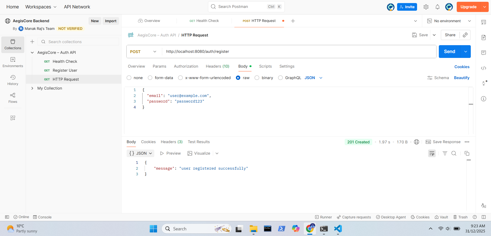
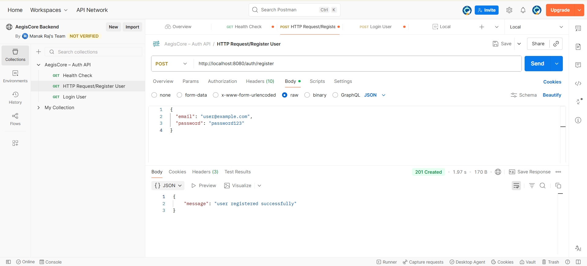
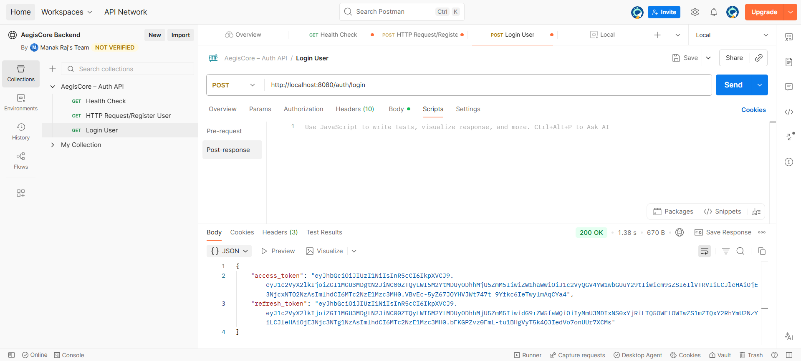
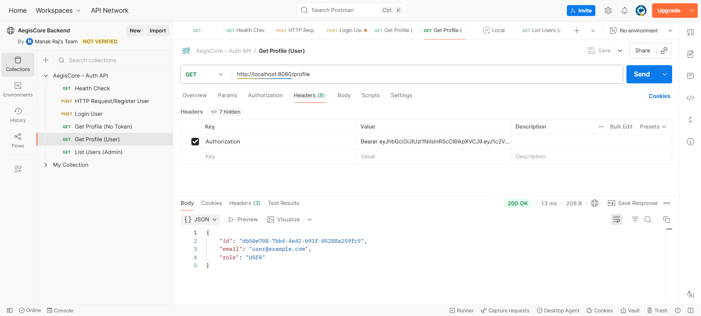
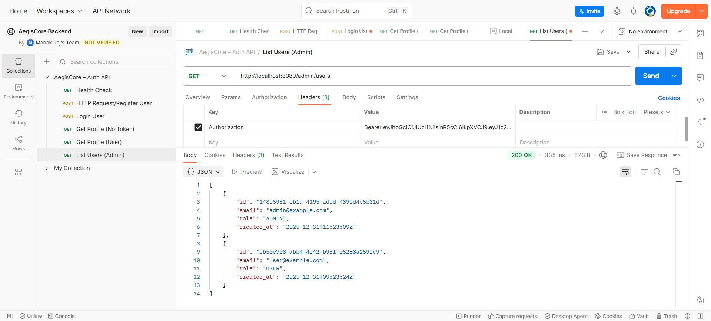
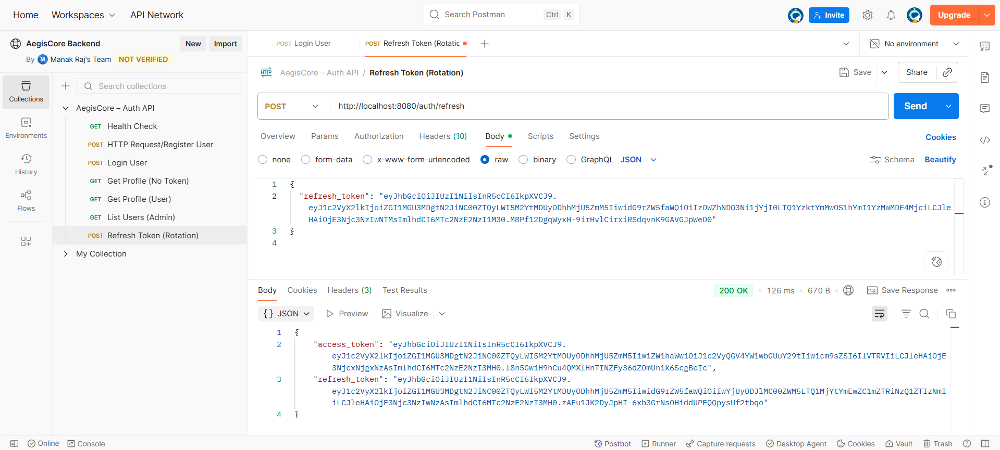
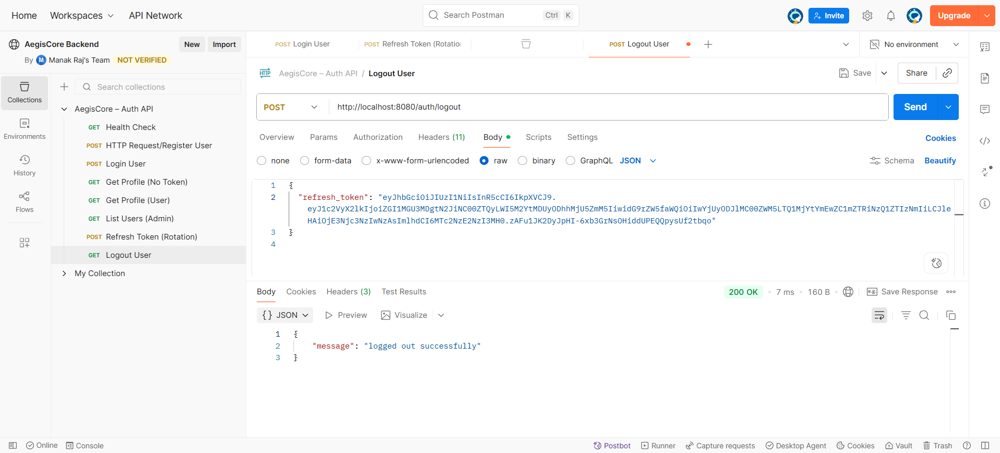
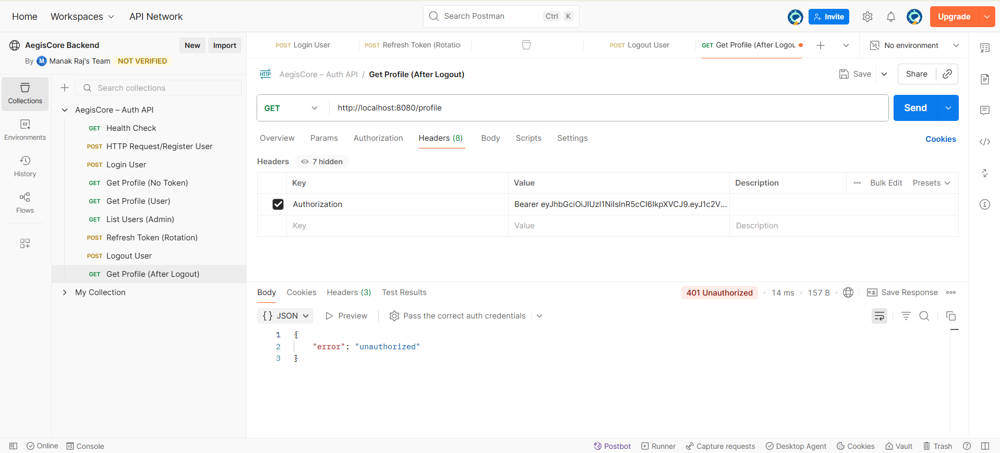

# AegisCore – Identity Authentication & Access Control System

AegisCore is a backend-only, industry-grade identity authentication and access control system built with Go.
The project is being developed incrementally in clearly defined phases, following clean architecture and real-world backend security practices.

AegisCore provides a complete authentication and authorization system ready for production use.

---

## Project Status

✅ Phase 1 – Foundation Setup (Completed)  
✅ Phase 2 – Core Authentication: Register & Login (Completed)  
✅ Phase 3 – Authorization & RBAC (Completed)  
✅ Phase 4 – Token Lifecycle & Logout (Completed)  
✅ Phase 5 – Final Polish & Stability (Completed)

---

## Phase 1: Foundation Setup (Completed)

Phase 1 establishes the backend infrastructure and runtime environment:

- Configuration management using Viper and `.env`
- Structured logging
- PostgreSQL connection (local)
- Redis connection (local)
- HTTP server using Gin
- Health check endpoint

**Endpoint**

```
GET /health
```

Response:
```json
{
  "status": "ok"
}
```



---

## Phase 2: Core Authentication (Completed)

Phase 2 introduces secure user authentication following production-grade practices.

### Implemented Features

#### User Registration

```
POST /auth/register
```

* Email format validation
* Password length validation (minimum 8 characters)
* Secure password hashing using bcrypt
* Unique email enforcement
* User persistence in PostgreSQL
* Default role assignment (`USER`)

Response:

```json
{
  "message": "user registered successfully"
}
```



---

#### User Login

```
POST /auth/login
```

* Credential verification
* Secure password comparison
* JWT access token generation
* JWT refresh token generation
* Refresh token persistence in PostgreSQL

Response:

```json
{
  "access_token": "...",
  "refresh_token": "..."
}
```



---

### Authentication Details

* Access Token:
  * Short-lived (~15 minutes)
  * Contains user ID, email, role, and expiry
* Refresh Token:
  * Long-lived (~7 days)
  * Used for future token lifecycle management
* JWT signing:
  * HS256
  * Secrets loaded from environment variables
* No hardcoded secrets

---

## Phase 3: Authorization & RBAC (Completed)

Phase 3 introduces authorization and access control on top of existing authentication.

- JWT authentication middleware
- User identity extraction via context
- Role-based access control (RBAC)
- Protected routes for authenticated users
- Admin-only endpoints

### Endpoints

#### User Profile

```
GET /profile
```

* Requires valid access token
* Returns authenticated user's information
* Protected by authentication middleware



#### Admin Users List

```
GET /admin/users
```

* Requires valid access token
* Requires ADMIN role
* Returns list of all users
* Protected by authentication and role-based middleware



---

## Phase 4: Token Lifecycle & Logout (Completed)

Phase 4 implements production-grade token lifecycle management with refresh token rotation and immediate logout capabilities.

### Implemented Features

1. **Refresh Token Rotation**
   - Token refresh endpoint (`POST /auth/refresh`)
   - Automatic invalidation of old refresh tokens
   - New token pair generation on each refresh
   - Prevents token replay attacks



2. **Logout Confirmation**
   - Logout endpoint (`POST /auth/logout`)
   - Immediate refresh token deletion from database
   - Successful logout confirmation



3. **Access Token Blacklisting (Redis)**
   - Redis-based token blacklist
   - Immediate token invalidation on logout
   - TTL-based automatic cleanup
   - Middleware integration for blacklist checking



### Security Features

* Token rotation prevents reuse of old refresh tokens
* Redis blacklist ensures immediate logout effectiveness
* Database cleanup removes refresh tokens on logout
* TTL-based expiration matches token lifetime

---

## Phase 5: Final Polish & Stability (Completed)

Phase 5 focuses on production readiness, code quality, and developer experience.

### Implemented Features

1. **Centralized Error Handling**
   - Standardized error responses across all endpoints
   - Proper HTTP status codes (400, 401, 403, 409, 500)
   - No internal error leakage to clients
   - Consistent error message format

2. **Request Validation**
   - Email format validation
   - Password strength validation
   - Required field validation
   - Early rejection of invalid input

3. **Structured Logging**
   - Consistent logging across all operations
   - Log levels (INFO, WARN, ERROR)
   - Security-conscious logging (no passwords or tokens)
   - Request tracking and error logging

4. **Configuration Management**
   - Complete `.env.example` file
   - All configurable values from environment
   - No hardcoded secrets or credentials

5. **Postman Collection**
   - Complete API collection with all endpoints
   - Environment variables for tokens
   - Automated token extraction on login/refresh
   - Ready for demos and testing

---

## Prerequisites

* Go 1.21 or higher
* PostgreSQL (running locally)
* Redis (running locally)

---

## Setup & Running Locally

1. Clone the repository:

```bash
git clone <repository-url>
cd aegis-core
```

2. Install dependencies:

```bash
go mod tidy
```

3. Create environment configuration:

```bash
cp .env.example .env
```

4. Update `.env` with your local credentials:

```env
SERVER_PORT=8080
DB_HOST=localhost
DB_PORT=5432
DB_USER=postgres
DB_PASSWORD=your_password
DB_NAME=aegis_core
REDIS_ADDR=localhost:6379
REDIS_PASSWORD=
JWT_ACCESS_SECRET=your_super_secret_access_key_here_minimum_32_characters
JWT_REFRESH_SECRET=your_super_secret_refresh_key_here_minimum_32_characters
```

5. Run database migration:

```bash
psql -U postgres -d aegis_core -f migrations/001_create_users_and_tokens.sql
```

6. Ensure PostgreSQL and Redis are running.

7. Start the server:

```bash
go run cmd/server/main.go
```

---

## Project Structure

```
aegis-core/
├── cmd/
│   └── server/
│       └── main.go
├── internal/
│   ├── config/
│   ├── logger/
│   ├── handlers/
│   ├── service/
│   ├── repository/
│   ├── cache/
│   ├── models/
│   └── utils/
├── migrations/
│   └── 001_create_users_and_tokens.sql
├── Screenshots/
│   ├── postman-health.png
│   ├── postman-register.png
│   ├── postman-login.png
│   ├── postman-profile-user.png
│   ├── postman-admin-users.png
│   ├── postman-refresh-rotation.png
│   ├── postman-logout-success.png
│   └── postman-logout-blacklist.png
├── postman/
│   └── AegisCore.postman_collection.json
├── .env.example
├── go.mod
├── go.sum
└── README.md
```

---

## Tech Stack

* **Language**: Go
* **HTTP Framework**: Gin
* **Database**: PostgreSQL (local)
* **Cache**: Redis (local)
* **Authentication**: JWT (Access & Refresh Tokens)
* **Password Security**: bcrypt
* **Configuration**: Viper + `.env`
* **Logging**: Structured logging (Zap)
* **Dependency Management**: Go Modules

---

## API Overview

### Authentication Endpoints

- `POST /auth/register` - Register a new user
- `POST /auth/login` - Login and receive access/refresh tokens
- `POST /auth/refresh` - Refresh access token using refresh token
- `POST /auth/logout` - Logout and invalidate tokens

### Protected Endpoints

- `GET /profile` - Get authenticated user's profile (requires access token)
- `GET /admin/users` - List all users (requires ADMIN role)

### Public Endpoints

- `GET /health` - Health check endpoint

### Error Responses

All endpoints return standardized error responses:

```json
{
  "error": "error message"
}
```

**HTTP Status Codes:**
- `400 Bad Request` - Invalid input or validation error
- `401 Unauthorized` - Missing or invalid authentication
- `403 Forbidden` - Insufficient permissions
- `409 Conflict` - Resource conflict (e.g., email already exists)
- `500 Internal Server Error` - Server error

## Security Notes

- Passwords are hashed using bcrypt before storage
- JWT tokens are signed with HS256 algorithm
- Access tokens expire in 15 minutes
- Refresh tokens expire in 7 days
- Token rotation prevents refresh token reuse
- Redis blacklist ensures immediate logout
- No passwords or tokens are logged
- All secrets loaded from environment variables

## Architecture

AegisCore follows clean architecture principles:

- **Handlers**: HTTP request/response handling
- **Services**: Business logic and orchestration
- **Repository**: Database access layer
- **Cache**: Redis operations for token blacklisting
- **Middleware**: Authentication and authorization
- **Utils**: Shared utilities (JWT, validation, errors)

This separation ensures maintainability, testability, and scalability.